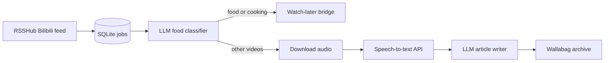

# bilibili-summary

Turn a Bilibili following feed into searchable, long-form reading notes.

`bilibili-summary` is a small Python pipeline for people who follow many Bilibili creators but prefer reading the useful parts later. It polls an RSSHub feed, deduplicates videos in SQLite, filters cooking/food videos into a watch-later bridge, transcribes the remaining videos, asks an OpenAI-compatible LLM to write a polished Chinese article, and archives the result to Wallabag.

The project was extracted from a private n8n workflow and cleaned up for code-first, Docker-friendly operation.

## What It Does

- Polls a Bilibili following RSS feed from RSSHub.
- Stores resumable jobs in SQLite.
- Classifies food/cooking videos and optionally sends them to a watch-later bridge.
- Downloads audio for non-food videos.
- Sends audio to an OpenAI-compatible STT endpoint.
- Summarizes transcripts with an OpenAI-compatible chat completion endpoint.
- Publishes rich HTML entries to Wallabag.



## Quickstart

```bash
python -m venv .venv
source .venv/bin/activate
pip install -e '.[test]'
cp .env.example .env

bilibili-summary init-db
bilibili-summary poll-once --dry-run
bilibili-summary run-resumable --limit 1 --dry-run
```

The dry-run commands are intentionally safe: they initialize local state and exercise the pipeline without creating Wallabag entries or changing watch-later state. Remove `--dry-run` only after your private `.env` is configured.

## Configuration

Copy `.env.example` to `.env` and fill in your private endpoints and credentials.

| Variable | Purpose |
| --- | --- |
| `RSS_FEED_URL` | RSSHub route for Bilibili following videos. |
| `DB_PATH` | SQLite database path. |
| `DOWNLOAD_DIR` | Audio download directory. |
| `STT_BASE_URL` / `STT_MODEL` | OpenAI-compatible transcription endpoint and model. |
| `LLM_BASE_URL` / `LLM_API_KEY` / `LLM_MODEL` | OpenAI-compatible chat endpoint used for classification and article writing. |
| `WALLABAG_*` | Wallabag OAuth credentials and target instance. |
| `WATCH_LATER_URL` / `WATCH_LATER_TOKEN` | Optional bridge for videos that should be skipped and watched later. |

Never commit `.env`, cookies, downloaded audio, SQLite databases, or generated logs. The repository ignore rules and Docker examples are designed around that assumption.

## CLI

```bash
bilibili-summary init-db
bilibili-summary poll-once [--dry-run]
bilibili-summary run-pending [--limit 5] [--dry-run]
bilibili-summary run-resumable [--limit 5] [--dry-run]
bilibili-summary retry-failed [--limit 5] [--dry-run]
bilibili-summary show-jobs [--status discovered|failed|archived] [--limit 20]
```

Use `run-resumable` for routine operation. It continues jobs from discovered, audio-downloaded, transcribed, and summarized states.

## Docker

Build locally:

```bash
docker build -t bilibili-summary:local .
```

Run with a private env file and a persistent data volume:

```bash
docker run --rm \
  --env-file .env \
  -v "$PWD/data:/app/data" \
  bilibili-summary:local \
  run-resumable --limit 5
```

For a scheduler-friendly example, see `compose.example.yml` and `docs/deployment.md`.

## RSSHub Cookie Automation

Bilibili routes in RSSHub often require a fresh logged-in cookie. This repository includes a documented browser-profile based approach in `docs/rsshub-cookie-automation.md`: keep a persistent Chromium profile logged in to Bilibili, export cookies on a schedule, update a private RSSHub env file, restart RSSHub, and health-check the feed before accepting the new cookie.

The automation is intentionally documented as a deployment pattern rather than hard-coding any private host, cookie, or container name into this public repository.

## Development

```bash
pip install -e '.[test]'
pytest
```

The test suite covers RSS parsing, retry behavior, SQLite job state, Wallabag dry-run behavior, and LLM JSON extraction.

## Security

This project is safe to publish only when real credentials remain outside the repository. See `SECURITY.md` for the handling policy. In short: keep `.env`, browser profiles, cookies, SQLite data, audio files, and logs private.
