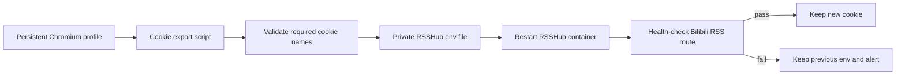

# RSSHub Bilibili Cookie Automation

RSSHub Bilibili following routes can require a logged-in Bilibili cookie. A practical automation pattern is to keep one persistent Chromium profile logged in and export cookies from that profile on a schedule.

This document describes the deployment pattern without storing any private cookie value in the repository.

## Target Flow



## Recommended Design

1. Create a dedicated browser profile for Bilibili login.
2. Log in manually once and complete any verification.
3. Run a scheduled script weekly:
   - Launch Chromium with the persistent profile.
   - Visit `https://www.bilibili.com`.
   - Export cookies for `.bilibili.com`.
   - Verify required names such as `SESSDATA`, `bili_jct`, and `DedeUserID`.
   - Render the cookie string as `BILIBILI_COOKIE_<uid>=...` into a private env file.
   - Restart or recreate RSSHub with that env file.
   - Request the target RSSHub route and require HTTP 200 before accepting the update.
4. If validation or health-check fails, keep the old env file and alert for manual login.

## RSSHub Container Management

For repeatable updates, prefer managing RSSHub with Docker Compose or another env-file based deployment. Avoid hand-editing long cookie values in a UI.

Example private env file shape:

```dotenv
BILIBILI_COOKIE_<uid>=<exported-cookie-string>
CACHE_TYPE=memory
CACHE_EXPIRE=300
```

Do not commit this file.

## Minimal Playwright Export Sketch

The exact script belongs in a private operations repository because it references host paths and restart commands, but the core idea is:

```python
from pathlib import Path
from playwright.sync_api import sync_playwright

profile = Path("/private/path/to/bilibili-profile")
required = {"SESSDATA", "bili_jct", "DedeUserID"}

with sync_playwright() as p:
    context = p.chromium.launch_persistent_context(str(profile), headless=True)
    page = context.new_page()
    page.goto("https://www.bilibili.com", wait_until="domcontentloaded")
    cookies = context.cookies("https://www.bilibili.com")
    context.close()

selected = [c for c in cookies if "bilibili.com" in c.get("domain", "")]
names = {c["name"] for c in selected}
missing = required - names
if missing:
    raise SystemExit(f"login cookie missing required names: {sorted(missing)}")

cookie = "; ".join(f"{c['name']}={c['value']}" for c in selected)
print(cookie)
```

## Safety Checklist

- Cookie export path is private and backed up only if encrypted.
- The script never prints cookie values to shared logs.
- The previous RSSHub env file is kept until the new feed health-check passes.
- Alerts clearly say "Bilibili login expired" without including cookie content.
